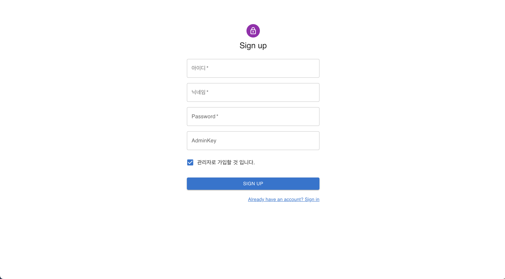
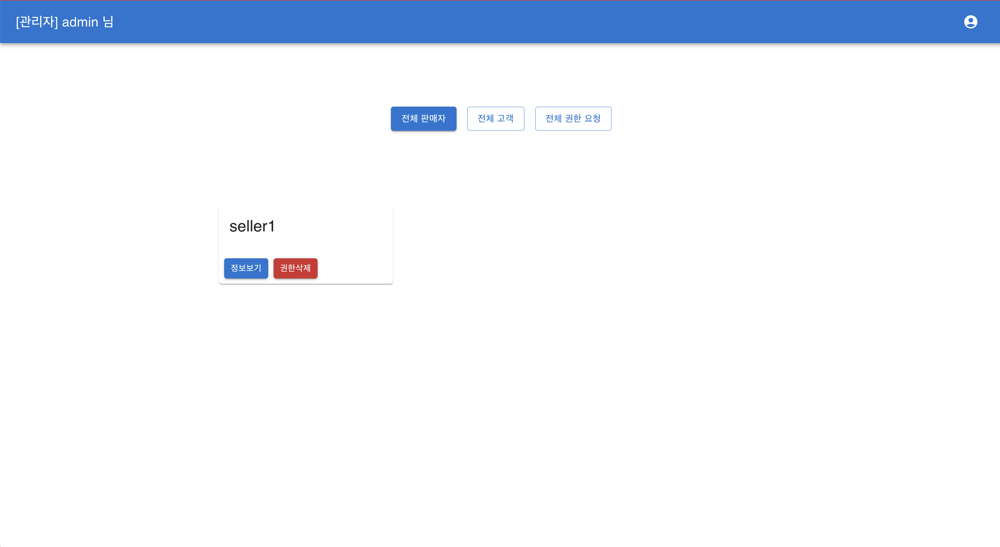
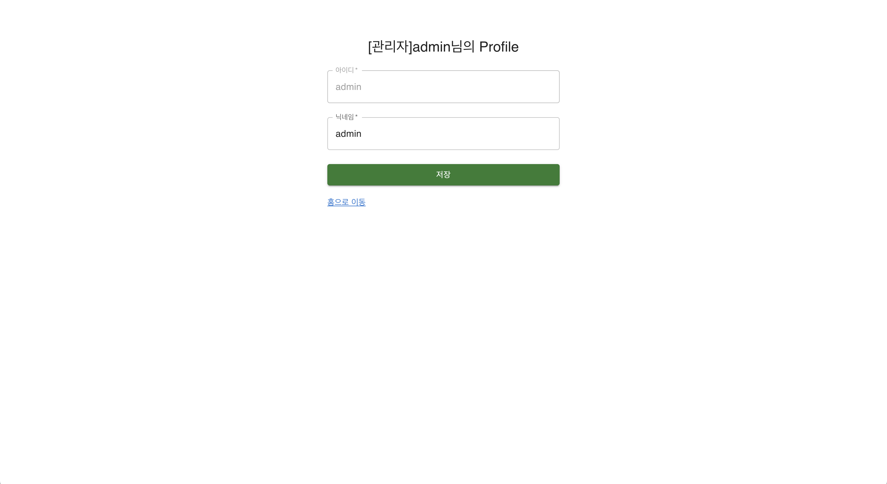
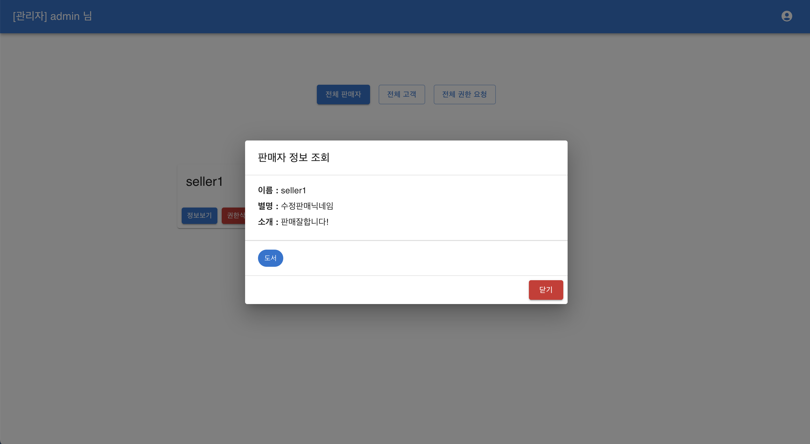
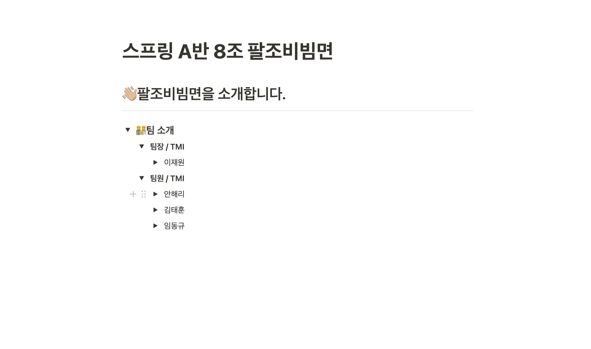
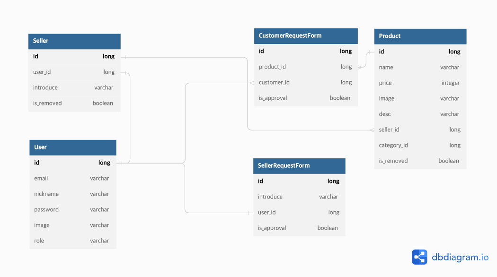
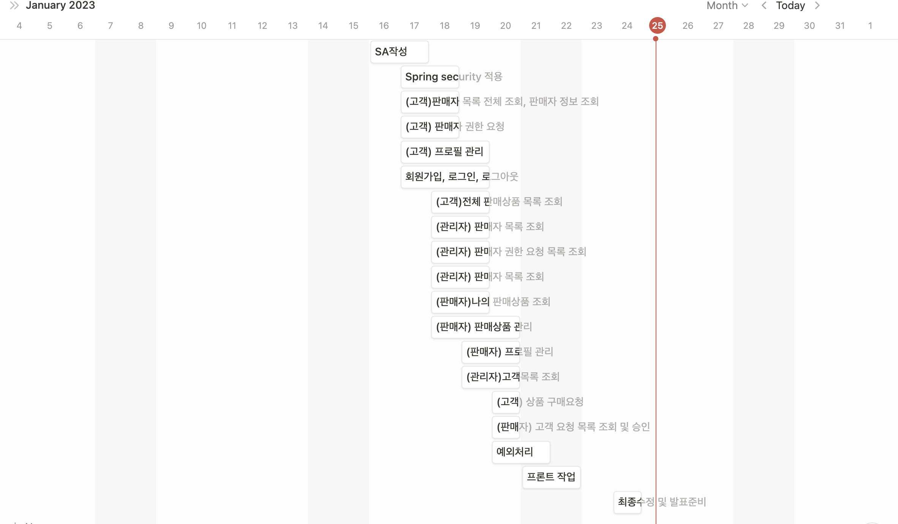
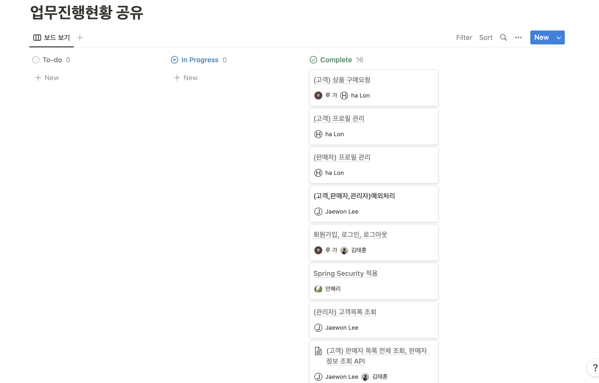
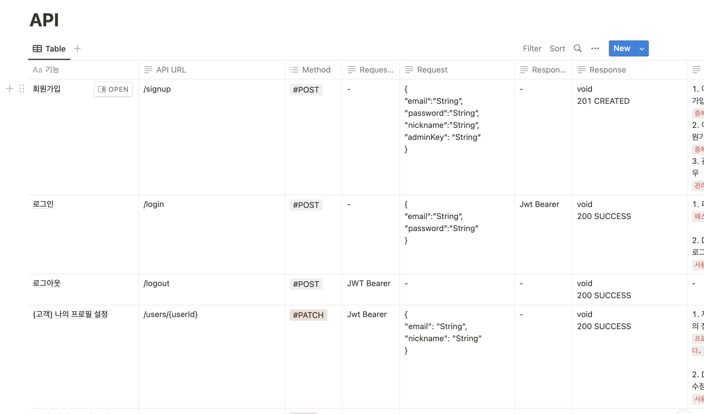

# 괄도네넴띤 (a.k.a 팔조비빔면)

<details>

<summary>프로젝트 프리뷰</summary>
<figure>
    
    <figcaption style="text-align: center">로그인 페이지</figcaption>
</figure>
<figure>
    
    <figcaption style="text-align: center">회원가입 페이지</figcaption>
</figure>
<figure>
    
    <figcaption style="text-align: center">메인 페이지 (권한별 메뉴 차이있음)</figcaption>
</figure>
<figure>
    
    <figcaption style="text-align: center">프로필 페이지 (판매자는 자기소개도 보임)</figcaption>
</figure>
<figure>
    
    <figcaption style="text-align: center">기능별 다이얼로그 모달(정보조회/상품생성 등)</figcaption>
</figure>
</details>

<details>
<summary>프로젝트 환경</summary>
<ul>
    <details>
        <summary>프론트엔드</summary>
        <div>node v16.17.0</div>
        <div>npm v8.15.0</div>
        <div>React v18.2.0</div>
    </details>
    <details>
        <summary>백엔드</summary>
        <div>jdk v11</div>
        <div>spring-boot v2.7.7</div>
        <div>mysql</div>
    </details>
</ul>
</details>

## 1. 팀원 소개
[](https://www.notion.so/A-8-de7a16cbfe2747f8a9a17239f4ef77f4)
## 2. 프로젝트 ERD

## 3. 프로젝트 일정 관리
[](https://www.notion.so/b3e78bb984c649ffa5ec0d01b8fe7687?v=7748685a99394f82a9287da4dc376f21)
[](https://www.notion.so/9a0b578cfb774a7aad1df9010ec6f7ea?v=6a94ebf448d74288851c9c544d8f526a)
## 4. API 문서
[](https://www.notion.so/a6f589a796c246ccb9b6b9ce2fd468f8?v=781edbbef58d4cf4b4e4b0aef9768cfe)

### application.properties
```
# mysql config
spring.datasource.driver-class-name=com.mysql.cj.jdbc.Driver
spring.datasource.url=jdbc:mysql://localhost:3306/tomato?createDatabaseIfNotExist=true&serverTimezone=UTC&characterEncoding=UTF-8
spring.datasource.username=
spring.datasource.password=

# jpa config
spring.jpa.hibernate.ddl-auto=update
spring.jpa.generate-ddl=true
spring.jpa.show-sql=true

# env
jwt.secret.key=
admin.secret.key=
```
### 프론트 실행 방법
```
// root 디렉토리의 client 폴더로 이동합니다.
cd client

// package.json 에 정의된 모듈들을 모두 받아줍니다.
npm install

// 프로젝트를 실행합니다.
npm start
```